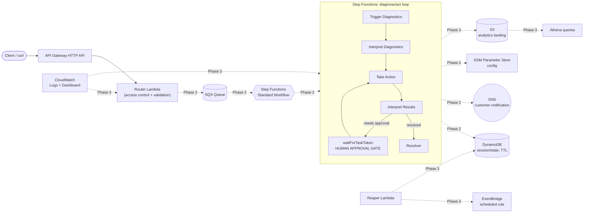

# SmartHelp Telco Support Automation Engine (Portfolio POC)

A scaled-down, faithful replica of a serverless telco-support automation
engine: a customer reports a broadband issue, the system runs a
diagnose → interpret → act → interpret loop, pauses for **human approval**
before any network-impacting action, then notifies the customer and records
the resolution. This repo is both a deployable AWS project and my interview
study guide for it — architecture rationale and Q&A live in this README as
the project grows.

**Status: Phase 1 of 5 — deployed and verified in `dev`.** API Gateway →
Lambda is live (`GET /health`, `POST /cases` both tested end-to-end against
the real AWS endpoint, including the powertools structured logs landing in
CloudWatch). Everything else in
the architecture diagram below is designed but not yet built; phases are
tracked at the bottom of this file.

## Architecture (target — grayed-out pieces arrive in later phases)



### Request flow (current, Phase 1)

1. Client sends `GET /health` or `POST /cases` to the API Gateway HTTP API
   `$default` stage.
2. API Gateway proxies the entire event to a single **router Lambda**
   (`AWS_PROXY` integration, payload format 2.0).
3. Inside the Lambda, `aws-lambda-powertools`'s `APIGatewayHttpResolver` does
   the actual GET/POST routing and JSON body validation — API Gateway itself
   stays a dumb pipe. This is the same "one router Lambda, internal routing"
   shape the real system uses for its access-control layer.
4. `POST /cases` currently just validates `customer_id` + `issue_type` and
   echoes an acknowledgment. Phase 2 replaces the echo with an SQS `SendMessage`
   that kicks off the Step Functions workflow.

## Why these choices (interview notes — grows every phase)

**Why API Gateway *HTTP API* and not a REST API?**
HTTP APIs are ~70% cheaper per request and have lower latency than REST APIs
for straightforward proxy-Lambda use cases. REST API's extra features
(request validation models, usage plans, API keys, WAF integration) aren't
needed here — the router Lambda does its own validation. I'd reach for REST
API if this needed per-key usage plans/quotas or edge-optimized custom domains
with WAF.

**Why one router Lambda with internal routing instead of one Lambda per
route?**
Mirrors the real system's access/router layer: a single entry point owns
auth/validation concerns uniformly, and `APIGatewayHttpResolver` gives
Flask-like `@app.get`/`@app.post` decorators so it doesn't turn into a big
if/elif block. It also means one cold start path and one IAM role to reason
about for the entry point, with business logic split into separate Lambdas
further into the workflow (Phase 2).

**Why build the Powertools Lambda layer ourselves instead of using AWS's
public layer ARN?**
AWS publishes a managed Powertools layer, but its ARN is
region/version/architecture-specific and lives outside this repo — anyone
cloning it would need to look up the right ARN. Building it via
`pip install --target` + `archive_file` keeps the dependency pinned and
reproducible from `requirements.txt`, at the cost of a slightly more complex
module (see `infra/modules/lambda_layer`). Trade-off I'd mention: the
self-built layer costs a `pip install` on every `requirements.txt` change;
the public layer costs nothing to adopt but couples you to AWS's release
cadence and ARN naming.

**How is IAM least-privilege applied?**
Every Lambda gets its own execution role (not a shared one). The `lambda`
module scopes the logging policy to that function's exact log group ARN
(`${log_group_arn}:*`), not `arn:aws:logs:*:*:*`. Later phases attach an
`additional_policy_json` per function — e.g. the diagnose Lambda gets
DynamoDB write access, the resolver gets SNS publish — rather than one broad
policy shared across all functions.

**Why S3 + DynamoDB for remote state, and why split by `-backend-config`
instead of Terraform workspaces?**
S3 gives durable, versioned state; the DynamoDB table provides state locking
so two `apply`s can't race. I used per-env `backend.hcl` + `-var-file`
instead of workspaces because workspaces share the same backend config and
make it easy to accidentally apply the wrong `.tfvars` against the wrong
state — separate backend keys per env (`dev/terraform.tfstate`,
`qa/...`, `prod/...`) make the blast radius of a mistake smaller and the
`terraform init` command itself makes the target environment explicit.

*Note:* recent AWS provider versions support native S3 locking
(`use_lockfile = true`, conditional writes, no DynamoDB table needed) and
deprecate the `dynamodb_table` backend parameter this repo uses. I kept the
DynamoDB-lock pattern deliberately — it's still fully supported, and it's
the pattern most interviewers will recognize; worth mentioning the newer
alternative exists if asked.

**Tagging strategy:** every resource gets `Project=telco-support-poc` and
`Environment=<env>` via the AWS provider's `default_tags`, so Cost Explorer
can filter by tag without me having to remember to tag each resource
individually.

## Repo layout

```
infra/
  versions.tf, providers.tf, variables.tf, main.tf, outputs.tf   # root module
  envs/{dev,qa,prod}/{backend.hcl, <env>.tfvars}                 # per-env config
  modules/
    lambda/          # generic Lambda function + its own log group + IAM role
    lambda_layer/     # pip-installs a requirements.txt into a Lambda layer
    http_api/         # API Gateway HTTP API, $default route/stage, access logs
src/
  router/handler.py   # the Phase 1 Lambda
  layers/powertools/requirements.txt
tests/                # pytest, one test module per Lambda
.github/workflows/     # CI/CD (Phase 4)
```

## One-time setup: bootstrap the Terraform state backend

The S3 bucket and DynamoDB lock table have to exist *before* `terraform init`
can use them as a backend — Terraform can't create the backend it's about to
store state in. Run once, with the AWS CLI, picking a globally-unique bucket
suffix (e.g. your account ID):

```bash
export STATE_SUFFIX=<your-unique-suffix>   # e.g. your 12-digit AWS account ID
export AWS_REGION=us-east-1

aws s3api create-bucket \
  --bucket telco-support-poc-tfstate-$STATE_SUFFIX \
  --region $AWS_REGION

aws s3api put-bucket-versioning \
  --bucket telco-support-poc-tfstate-$STATE_SUFFIX \
  --versioning-configuration Status=Enabled

aws s3api put-bucket-encryption \
  --bucket telco-support-poc-tfstate-$STATE_SUFFIX \
  --server-side-encryption-configuration '{"Rules":[{"ApplyServerSideEncryptionByDefault":{"SSEAlgorithm":"AES256"}}]}'

aws dynamodb create-table \
  --table-name telco-support-poc-tf-locks \
  --attribute-definitions AttributeName=LockID,AttributeType=S \
  --key-schema AttributeName=LockID,KeyType=HASH \
  --billing-mode PAY_PER_REQUEST
```

Then replace `<YOUR_UNIQUE_SUFFIX>` in `infra/envs/dev/backend.hcl` (and
qa/prod, once you use them) with the same suffix.

## Deploy (dev)

```bash
cd infra
terraform init -backend-config=envs/dev/backend.hcl
terraform plan  -var-file=envs/dev/dev.tfvars
terraform apply -var-file=envs/dev/dev.tfvars
```

The first `apply` pip-installs the Powertools layer locally (needs `pip3` on
your machine/CI runner) — expect that resource to show as
"(known after apply)" on the *first* `plan`, since the layer's zip contents
depend on a `terraform_data` provisioner that only runs at apply time.

## Demo

```bash
API=$(terraform -chdir=infra output -raw api_endpoint)

curl "$API/health"
# {"status":"ok","service":"telco-support-router"}

curl -X POST "$API/cases" \
  -H 'content-type: application/json' \
  -d '{"customer_id": "cust-123", "issue_type": "modem_offline"}'
# {"message":"case received","customer_id":"cust-123","issue_type":"modem_offline"}

curl -X POST "$API/cases" -H 'content-type: application/json' -d '{}'
# 400 — {"statusCode":400,"message":"missing required field(s): customer_id, issue_type"}
```

## Cost & Teardown

Everything provisioned so far (API Gateway HTTP API, one Lambda, one Lambda
layer, CloudWatch log groups) fits comfortably in AWS Free Tier for demo-level
traffic. Nothing in this phase runs 24/7 or bills per-hour.

To tear down:

```bash
cd infra
terraform destroy -var-file=envs/dev/dev.tfvars
```

The S3 state bucket and DynamoDB lock table from the bootstrap step are
**not** managed by this Terraform config (chicken-and-egg), so destroy them
manually if you want a full teardown:

```bash
aws s3 rb s3://telco-support-poc-tfstate-$STATE_SUFFIX --force
aws dynamodb delete-table --table-name telco-support-poc-tf-locks
```

## Deployment history — how this has actually been shipped so far

Being explicit about this because it's a common interview follow-up
("where's this hosted, how'd you deploy it") and because it's a deliberate,
staged choice, not an oversight:

- **Source control:** local git repo only so far (`git init` in this
  directory, 2 commits). **No GitHub remote configured yet** — nothing has
  been pushed anywhere.
- **Deploy mechanism for Phase 1: manual, from a local machine.** No
  pipeline exists yet. The sequence that actually happened:
  1. Installed the AWS CLI and Terraform locally (`brew install awscli`,
     `brew install hashicorp/tap/terraform`).
  2. Configured credentials with `aws configure` (an IAM user with
     `AdministratorAccess`, scoped to a personal sandbox account — verified
     with `aws sts get-caller-identity`).
  3. Ran the one-time bootstrap (S3 state bucket + DynamoDB lock table)
     via raw `aws` CLI commands, since Terraform can't create the backend
     it's about to store its own state in.
  4. `terraform init -backend-config=envs/dev/backend.hcl`, then
     `terraform plan` / `terraform apply -var-file=envs/dev/dev.tfvars` —
     applied directly against AWS account `705365103500`, region
     `us-east-1`.
  5. Verified the result wasn't just "terraform says success" — hit the
     live API Gateway URL with `curl` for `/health` and `/cases` (valid and
     invalid payloads), then tailed the actual CloudWatch log group
     (`aws logs tail /aws/lambda/telco-support-dev-router`) to confirm the
     Powertools structured logs (`cold_start`, `xray_trace_id`,
     `function_request_id`) were landing correctly.
- **This is intentional, not a gap:** doing Phases 1–3 with manual
  `terraform apply` means every new AWS concept (state locking, IAM roles,
  Step Functions, human-approval tokens, etc.) gets seen directly, one
  `apply` at a time, instead of being hidden behind a pipeline before it's
  understood. **Phase 4 is exactly this gap being closed on purpose:**
  push to a GitHub remote, then add GitHub Actions to do lint → pytest →
  `terraform plan` on PR → `terraform apply` on merge to `main` — the same
  stages the real production system ran through Jenkins + SonarQube.

## Interview Q&A (running list — grows every phase)

- **"Walk me through what happens when a request comes in."** → see Request
  flow above.
- **"Why not put all the routing logic in API Gateway?"** → API Gateway route
  keys would work for this simple case, but the real system's access layer
  needs to run auth/validation code, which belongs in Lambda, not gateway
  config — so it's one proxy route in and structured routing inside the
  function.
- **"How do you avoid a surprise AWS bill on a personal account?"** →
  Free-tier-only live services, `enable_tier2`/`enable_tier3` default false
  in Terraform so nothing that costs real money deploys by accident, no NAT
  Gateway anywhere, `terraform destroy` documented, resources tagged for
  Cost Explorer.
- **"Is this running through a CI/CD pipeline?"** → Not yet, by design —
  see "Deployment history" above. Phases 1–3 are deployed manually so each
  new AWS service is understood in isolation before automation hides the
  mechanics; Phase 4 adds GitHub Actions (lint/test/plan on PR, apply on
  merge), mirroring the real system's Jenkins + SonarQube stages.

## Learning notes (Phase 1) — concepts to know cold for interviews

Things worth being able to explain confidently, not just having typed:

1. **Terraform's plan/apply model.** State (now in the S3 bucket) is
   Terraform's record of what it believes exists; `plan` diffs that record
   against your `.tf` files before anything touches AWS. Running `plan`
   again with no code changes should show "0 to add, 0 to change,
   0 to destroy" — that's the mental model for everything built from here on.
2. **IAM: trust policy vs. permission policy.** See
   `infra/modules/lambda/main.tf` — `assume_role_policy` (trust policy)
   says *who* can assume the role (the Lambda service principal);
   `aws_iam_role_policy` (permission policy) says *what* it can do once
   assumed. Conflating these two is one of the most common IAM mistakes.
3. **Lambda execution model.** Cold start vs. warm (visible in the
   CloudWatch logs as `"cold_start":true`/`false`), the `(event, context)`
   handler signature, and that a layer is just a zip mounted onto
   `PYTHONPATH` — nothing more exotic than that.
4. **API Gateway `AWS_PROXY` integration.** The raw event is handed to
   Lambda untouched, and Lambda's response must match the expected shape
   (`statusCode`/`body`/`headers`) or API Gateway returns a 500 — that
   contract is the whole reason `APIGatewayHttpResolver` exists.
5. **CloudWatch log retention.** Lambda log groups default to *infinite*
   retention if you don't set one — `log_retention_days` in the `lambda`
   module exists specifically to avoid that silent cost creep at scale.

**Exercises that build intuition on what's already deployed:**
- Change the `/health` response text, run `terraform plan` — notice only
  the Lambda's `source_code_hash` changes, nothing else is touched.
- Deliberately break the handler path and `apply` — compare what an
  "infra is wrong" Terraform error looks like vs. what a broken-handler
  Lambda invocation looks like in CloudWatch. Telling those apart quickly
  is a real on-call skill.
- Run `aws lambda get-function --function-name telco-support-dev-router`
  and read the raw JSON — ties the console/Terraform view back to the
  underlying API.

## Phases

- [x] **Phase 1** — Terraform skeleton, backend, one Lambda, API Gateway (live)
- [ ] **Phase 2** — Step Functions workflow, DynamoDB, SQS, SNS,
      diagnose/act Lambdas, human-approval gate
- [ ] **Phase 3** — EventBridge reaper, CloudWatch dashboard, S3/Athena analytics
- [ ] **Phase 4** — GitHub Actions CI/CD
- [ ] **Phase 5 (optional, disabled by default)** — RDS/VPC, Glue/EMR, OpenSearch
