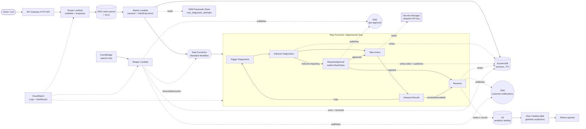
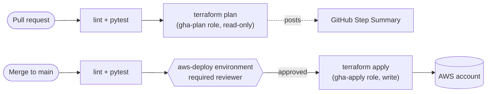

# SmartHelp Telco Support Automation Engine (Portfolio POC)

A scaled-down, faithful replica of a serverless telco-support automation
engine: a customer reports a broadband issue, the system runs a
diagnose → interpret → act → interpret loop, pauses for **human approval**
before any network-impacting action, then notifies the customer and records
the resolution. This repo is both a deployable AWS project and my interview
study guide for it — architecture rationale and Q&A live in this README as
the project grows.

**Status: Phase 4 of 5 — deployed and verified in `dev`, now with CI/CD.**
The full diagnose → interpret → act → interpret loop runs end-to-end on
real AWS: a case submitted through API Gateway is picked up off SQS, run
through a Step Functions Standard workflow, paused at a
`waitForTaskToken` gate for network-impacting actions, resumed via the
AWS CLI, and resolved with the final state written to DynamoDB and a
customer notification published to SNS. A scheduled reaper Lambda
reconciles sessions orphaned by executions that die outside their own
error handling, every resolved case lands one analytics record in S3
queryable via Athena with zero crawler/ETL infra, and a CloudWatch
dashboard rolls up API Gateway, Step Functions, SQS, Lambda, and DynamoDB
metrics in one place. The repo is now on GitHub
([RakeshSim/smarthelp-telco-poc](https://github.com/RakeshSim/smarthelp-telco-poc))
with a GitHub Actions pipeline: lint + pytest on every push/PR, a
read-only `terraform plan` on pull requests, and `terraform apply` on
merge to `main` gated behind a required manual approval — via two
separate AWS IAM roles assumed through OIDC, not stored access keys.
Phase 5 (optional Tier 2/3 modules) is designed but not yet built; phases
are tracked at the bottom of this file.

## Architecture (target — grayed-out pieces arrive in later phases)



### Request flow (current, Phase 3)

1. Client sends `POST /cases` to the API Gateway HTTP API `$default` stage.
2. The **router Lambda** validates the body and does exactly one thing:
   `sqs:SendMessage` onto the cases queue, returning `202 Accepted` with a
   generated `case_id` immediately. It never touches DynamoDB or Step
   Functions — that split keeps the client-facing response fast regardless
   of how long session setup takes downstream.
3. The **starter Lambda** (SQS event source mapping, `batch_size=1`) turns
   that message into a running workflow: it calls
   `states:StartExecution` (execution name = `case_id`, so retries are
   idempotent) and then writes the initial DynamoDB session record
   (`ConditionExpression="attribute_not_exists(case_id)"`, so a duplicate
   SQS delivery is a no-op). It also reads `max_diagnostic_attempts` from
   SSM Parameter Store, cached at cold start.
4. The Step Functions **Standard** workflow runs the loop:
   - `TriggerDiagnostics` → `InterpretDiagnostics` (a rules engine that also
     writes the interim decision to DynamoDB).
   - If the recommended action is network-impacting (`REBOOT`/`DISPATCH`),
     the workflow enters `RequestApproval` — a `lambda:invoke.waitForTaskToken`
     Task that persists the pause token to DynamoDB and publishes an SNS
     notification, then genuinely pauses (bounded by a 24h `TimeoutSeconds`)
     until something outside the state machine calls
     `SendTaskSuccess`/`SendTaskFailure`.
   - Once approved (or if no approval was needed), `TakeAction` executes the
     action (DISPATCH reads a mock API key from Secrets Manager),
     `InterpretResults` decides resolved / loop-back / escalate, bounded by
     `max_attempts` so the loop can't spin forever.
   - `Resolver` (also the target of every `Catch`) writes the final
     DynamoDB status and publishes a customer notification to SNS.
5. Approving a paused case in this POC is a manual AWS CLI step (see
   "Demo: approving a pending case" below) rather than a dedicated approval
   API/UI — deliberately, to keep the interesting content here about the
   Step Functions human-in-the-loop mechanics, not a second CRUD endpoint.
6. `Resolver` also drops one JSON analytics record into S3
   (`resolutions/dt=YYYY-MM-DD/case_id.json`) — the Glue Catalog table over
   that prefix uses **partition projection**, so Athena can query new dates
   immediately with no crawler run and no `MSCK REPAIR TABLE` step.
7. Independently of any single execution, an **EventBridge rate rule**
   invokes the **reaper Lambda** every 15 minutes. It scans DynamoDB for
   sessions stuck in `IN_PROGRESS`/`PENDING_APPROVAL` longer than
   `reaper_stale_after_minutes`, and for each one asks Step Functions
   whether the execution is still `RUNNING`. If it's not — aborted,
   manually stopped, or otherwise died without reaching `Resolver` — the
   reaper force-resolves it to `EXPIRED`. If it *is* still running (a
   slow approval), it sends a reminder notification and leaves the
   execution alone.

## Why these choices (interview notes — grows every phase)

**Why API Gateway *HTTP API* and not a REST API?**
HTTP APIs are ~70% cheaper per request and have lower latency than REST APIs
for straightforward proxy-Lambda use cases. REST API's extra features
(request validation models, usage plans, API keys, WAF integration) aren't
needed here — the router Lambda does its own validation. I'd reach for REST
API if this needed per-key usage plans/quotas or edge-optimized custom domains
with WAF.

**Why one router Lambda with internal routing instead of one Lambda per
route?**
Mirrors the real system's access/router layer: a single entry point owns
auth/validation concerns uniformly, and `APIGatewayHttpResolver` gives
Flask-like `@app.get`/`@app.post` decorators so it doesn't turn into a big
if/elif block. It also means one cold start path and one IAM role to reason
about for the entry point, with business logic split into separate Lambdas
further into the workflow (Phase 2).

**Why build the Powertools Lambda layer ourselves instead of using AWS's
public layer ARN?**
AWS publishes a managed Powertools layer, but its ARN is
region/version/architecture-specific and lives outside this repo — anyone
cloning it would need to look up the right ARN. Building it via
`pip install --target` + `archive_file` keeps the dependency pinned and
reproducible from `requirements.txt`, at the cost of a slightly more complex
module (see `infra/modules/lambda_layer`). Trade-off I'd mention: the
self-built layer costs a `pip install` on every `requirements.txt` change;
the public layer costs nothing to adopt but couples you to AWS's release
cadence and ARN naming.

**How is IAM least-privilege applied?**
Every Lambda gets its own execution role (not a shared one). The `lambda`
module scopes the logging policy to that function's exact log group ARN
(`${log_group_arn}:*`), not `arn:aws:logs:*:*:*`. Each function attaches
only the `additional_policy_json` it actually needs — e.g. `diagnose` and
`interpret_results` are pure compute with no extra policy at all,
`interpret_diagnostics` gets `dynamodb:UpdateItem` and nothing else,
`act` gets exactly `secretsmanager:GetSecretValue` on the one dispatch
secret — rather than one broad policy shared across all functions.

**Why S3 + DynamoDB for remote state, and why split by `-backend-config`
instead of Terraform workspaces?**
S3 gives durable, versioned state; the DynamoDB table provides state locking
so two `apply`s can't race. I used per-env `backend.hcl` + `-var-file`
instead of workspaces because workspaces share the same backend config and
make it easy to accidentally apply the wrong `.tfvars` against the wrong
state — separate backend keys per env (`dev/terraform.tfstate`,
`qa/...`, `prod/...`) make the blast radius of a mistake smaller and the
`terraform init` command itself makes the target environment explicit.

*Note:* recent AWS provider versions support native S3 locking
(`use_lockfile = true`, conditional writes, no DynamoDB table needed) and
deprecate the `dynamodb_table` backend parameter this repo uses. I kept the
DynamoDB-lock pattern deliberately — it's still fully supported, and it's
the pattern most interviewers will recognize; worth mentioning the newer
alternative exists if asked.

**Tagging strategy:** every resource gets `Project=telco-support-poc` and
`Environment=<env>` via the AWS provider's `default_tags`, so Cost Explorer
can filter by tag without me having to remember to tag each resource
individually.

**Why split "starter" out of the router Lambda instead of having the
router call StartExecution directly?** Two different jobs with two
different latency/reliability profiles: the router's job is "acknowledge
the client fast," the starter's job is "reliably stand up durable state
for a case," which involves two API calls (DynamoDB + Step Functions) that
can be retried independently by SQS if the Lambda fails partway. Coupling
them would make the client's HTTP response wait on both.

**Why does `starter.py` call `StartExecution` *before* the DynamoDB
write, not after?** Both operations are individually idempotent
(`StartExecution` by execution name, the DynamoDB write by a
`ConditionExpression`), but SQS's at-least-once delivery means the Lambda
can die between the two calls and get redelivered. Whichever operation
runs second is the one that's "unsafe" to lose — doing `StartExecution`
first means a redelivery after a partial failure always still reaches the
DynamoDB write; if it were the other way round, a case could get a
session record but never actually start a workflow, silently stuck.

**Why `lambda:invoke.waitForTaskToken` for the approval gate instead of
`sns:publish.waitForTaskToken` directly?** SNS's native waitForTaskToken
integration would skip a Lambda, but the token still needs to land
*somewhere durable* (DynamoDB) so it can be looked up later by `case_id` —
that requires code to run regardless. Routing through a Lambda keeps every
Task in this workflow structurally identical (a Lambda invoke), which
made the whole state machine easier to build, test, and reason about than
mixing direct-service integrations with Lambda tasks for one special case.

**Why no approval API/UI?** The interesting, teachable mechanic here is
Step Functions pausing on a task token and resuming via
`SendTaskSuccess` — an API Gateway route + Lambda that just deserializes a
JSON body and calls the same SDK method wouldn't add anything to that
story, so approving via the AWS CLI (see the demo below) demonstrates the
identical human-in-the-loop pattern with less to build and explain.

**Why bound the loop with `max_attempts` in `interpret_results` instead of
relying only on Step Functions?** Step Functions doesn't have a built-in
"loop N times" primitive — a Choice state routing back to an earlier
state will run forever unless something in the data decides to stop. The
attempt counter (sourced from SSM config, not hardcoded) is that
something; `HandleFailure`'s Catch-based safety net protects against
*unexpected* errors, but the loop's *normal* termination is the
Lambda-level attempt bound.

**Why Secrets Manager for the dispatch API key but SSM for
`max_diagnostic_attempts`?** Secrets Manager adds automatic rotation
support and tighter access auditing, at ~$0.40/mo per secret — worth it
for something that's actually credential-shaped (an API key). A retry
count isn't a secret; SSM Parameter Store's String type is free and
sufficient. Using both in one project (rather than putting everything in
one or the other) is itself the point: pick the store based on what the
value *is*, not habit.

**Where does this design NOT enforce strict least-privilege?** The Step
Functions execution role's CloudWatch Logs permissions
(`logs:CreateLogDelivery` etc., see `infra/modules/step_functions/main.tf`)
are scoped to `resources = ["*"]` — this is a documented AWS requirement
for the log-delivery subscription mechanism Step Functions logging uses,
not a shortcut I chose. Worth naming directly if asked "is everything here
least-privilege" — the honest answer is "everywhere except one
AWS-mandated exception."

**Why does the reaper compute the execution ARN instead of calling
`ListExecutions`?** Standard Step Functions execution ARNs are
deterministic — `<state-machine-arn-with-execution-instead-of-stateMachine>:<execution-name>`
— and every execution's name here is exactly the `case_id` (set by the
starter Lambda). Given a stale DynamoDB item, the reaper can build the
exact execution ARN and call `DescribeExecution` directly: one read call
per stuck session, not a `ListExecutions` scan plus client-side filtering.

**Why does the reaper `Scan` DynamoDB instead of `Query`?** At this
table's demo scale a `Scan` with a `FilterExpression` is simple and
correct. A production system would add a GSI on `status` (or
`status`+`updated_at`) so this becomes a `Query` instead — I'd bring this
up unprompted in an interview as "the thing I'd change first before real
traffic," since a full-table Scan is the kind of thing that works fine at
POC scale and quietly becomes a cost/performance problem later.

**Why EventBridge `rate()` instead of a `cron()` expression?** The reaper
doesn't care about wall-clock time (midnight, business hours, etc.) — it
just needs to run "regularly." `rate(15 minutes)` says that directly;
`cron()` is for schedules tied to a specific time of day, which would be
the wrong tool even though it can technically express the same interval.

**Why a Glue Catalog table with partition projection instead of a Glue
crawler?** A crawler costs money per run and needs to be re-triggered (or
scheduled) every time a new `dt=` partition shows up in S3. Partition
projection is a table *property* — Athena computes valid partitions from
a date-range rule instead of reading them from the Glue Catalog's
partition list, so a brand-new date prefix is queryable the instant data
lands, with zero additional infrastructure. The trade-off: partition
projection only works because the S3 key structure is predictable
(`dt=YYYY-MM-DD/`) — a crawler would be the right call for less
structured or externally-produced data.

**Why does only `resolver` write analytics records, not the reaper too?**
An intentional gap, not an oversight: `EXPIRED` sessions the reaper
reconciles never reach `Resolver`, so they don't get an Athena row. I'd
flag this myself if asked "what would you improve" — the fix is either
having the reaper write its own analytics record, or (cleaner) having it
invoke `resolver` directly with a `{"error": ...}`-shaped input so the
existing single write path handles it too.

## Repo layout

```
infra/
  versions.tf, providers.tf, variables.tf, main.tf, outputs.tf   # root module
  cicd.tf                                                        # GitHub Actions OIDC provider + 2 IAM roles
  envs/{dev,qa,prod}/{backend.hcl, <env>.tfvars}                 # per-env config
  state_machine/telco_workflow.asl.json.tftpl                    # ASL, templated with each Lambda's ARN
  modules/
    lambda/           # generic Lambda function + its own log group + IAM role
    lambda_layer/      # pip-installs a requirements.txt into a Lambda layer
    http_api/          # API Gateway HTTP API, $default route/stage, access logs
    step_functions/    # state machine + its IAM role (scoped to just the Lambdas it invokes)
src/
  router/handler.py               # validate + enqueue
  starter/starter.py               # SQS -> DynamoDB session + StartExecution
  diagnose/diagnose.py             # mock diagnostics
  interpret_diagnostics/           # rules engine -> recommended_action
  request_approval/                # waitForTaskToken gate: persist token, notify
  act/act.py                        # performs the action (reads Secrets Manager for DISPATCH)
  interpret_results/                # resolved / loop / escalate decision
  resolver/resolver.py              # final DynamoDB write + customer SNS notification + S3 analytics record
  reaper/reaper.py                  # EventBridge-scheduled: reconciles orphaned/stale sessions
  layers/powertools/requirements.txt
tests/                # pytest, one test module per Lambda (29 tests)
.github/workflows/ci.yml   # lint -> test -> plan (PRs) / apply (merge, gated)
```

Phase 3's S3 bucket, Glue Catalog database/table, Athena workgroup,
EventBridge schedule, and CloudWatch dashboard are all single-instance
resources defined directly in `infra/main.tf` rather than new modules —
each only exists once in this project, so a module wrapper would be an
abstraction with no second caller to justify it (unlike `lambda`, called
9 times, or `step_functions`, whose ASL-templating logic is genuinely
reusable).

## One-time setup: bootstrap the Terraform state backend

The S3 bucket and DynamoDB lock table have to exist *before* `terraform init`
can use them as a backend — Terraform can't create the backend it's about to
store state in. Run once, with the AWS CLI, picking a globally-unique bucket
suffix (e.g. your account ID):

```bash
export STATE_SUFFIX=<your-unique-suffix>   # e.g. your 12-digit AWS account ID
export AWS_REGION=us-east-1

aws s3api create-bucket \
  --bucket telco-support-poc-tfstate-$STATE_SUFFIX \
  --region $AWS_REGION

aws s3api put-bucket-versioning \
  --bucket telco-support-poc-tfstate-$STATE_SUFFIX \
  --versioning-configuration Status=Enabled

aws s3api put-bucket-encryption \
  --bucket telco-support-poc-tfstate-$STATE_SUFFIX \
  --server-side-encryption-configuration '{"Rules":[{"ApplyServerSideEncryptionByDefault":{"SSEAlgorithm":"AES256"}}]}'

aws dynamodb create-table \
  --table-name telco-support-poc-tf-locks \
  --attribute-definitions AttributeName=LockID,AttributeType=S \
  --key-schema AttributeName=LockID,KeyType=HASH \
  --billing-mode PAY_PER_REQUEST
```

Then replace `<YOUR_UNIQUE_SUFFIX>` in `infra/envs/dev/backend.hcl` (and
qa/prod, once you use them) with the same suffix.

## Deploy (dev)

```bash
cd infra
terraform init -backend-config=envs/dev/backend.hcl
terraform plan  -var-file=envs/dev/dev.tfvars
terraform apply -var-file=envs/dev/dev.tfvars
```

The first `apply` pip-installs the Powertools layer locally (needs `pip3` on
your machine/CI runner) — expect that resource to show as
"(known after apply)" on the *first* `plan`, since the layer's zip contents
depend on a `terraform_data` provisioner that only runs at apply time.

**Optional: real email notifications.** Set `approver_email` and/or
`customer_notification_email` in `envs/dev/dev.tfvars` before applying to
subscribe a real address to the ops-approval / customer-notification SNS
topics — AWS emails a confirmation link you have to click before messages
start arriving. Left blank (the default), you verify everything via the
AWS CLI/console instead, as the demo below does.

## CI/CD Pipeline



`.github/workflows/ci.yml` runs on every PR and every push to `main`:

1. **`lint`** — `ruff check` + `black --check`.
2. **`test`** — the full pytest suite (29 tests) with coverage.
3. **`terraform-plan`** (PRs only) — assumes the read-only `gha-plan` IAM
   role via OIDC, runs `fmt -check` / `validate` / `plan` against `dev`,
   and posts the plan output to the workflow's Step Summary so it's
   visible without needing a separate PR-comment bot/action.
4. **`terraform-apply`** (push to `main` only) — assumes the write-capable
   `gha-apply` role, but only runs after a human approves it in the
   `aws-deploy` GitHub Environment (configured with a required reviewer) —
   so merging to `main` alone does **not** deploy; someone still has to
   click approve.

**Why OIDC instead of storing AWS access keys as GitHub secrets?** Access
keys are long-lived credentials that work from anywhere if leaked — OIDC
issues a short-lived token per workflow run, scoped by the identity
provider's trust policy to (in this case) one specific GitHub repo, with
no long-lived secret sitting in GitHub at all. `infra/cicd.tf` sets this
up: one `aws_iam_openid_connect_provider` plus two roles.

**Why two roles instead of one?** `gha-plan`'s trust policy accepts any
event in this repo via `StringLike` on `sub` (so a PR workflow can assume
it) but only holds `ReadOnlyAccess` plus read/write on Terraform's own
state object — harmless even if a malicious PR tried to abuse it.
`gha-apply`'s trust policy is restricted with `StringEquals` to exactly
`repo:<owner>@<owner_id>/<repo>@<repo_id>:environment:aws-deploy` — only
a workflow run for a job that specifies `environment: aws-deploy` can
assume it, never a plain PR build. (The numeric owner/repo IDs, and the
fact that specifying an `environment:` swaps the claim's suffix from a
ref to the environment name, aren't obvious from most docs/examples — I
confirmed both empirically with a temporary debug step that decoded a
real token's claims; see "Deployment history" below.) A single role
trusted broadly but holding write access would mean any PR — including
from a fork, if this were a more permissive repo config — could assume a
role capable of changing real infrastructure.

**Why does `gha-apply`'s policy scope IAM actions separately from
everything else?** The rest of the policy (`lambda:*`, `dynamodb:*`,
`states:*`, etc. on `Resource: "*"`) is broad because most of these
resources' ARNs don't exist until Terraform creates them — a real
bootstrap chicken-and-egg problem. IAM is the one service where I could
still scope tightly regardless: the `ScopedIamForProjectRolesOnly`
statement restricts every IAM action (including `iam:PassRole`) to
`role/telco-support-*`. Without that restriction, a compromised or buggy
merge to `main` could create/modify IAM roles anywhere in the account,
not just this project's — scoping it is what actually prevents privilege
escalation, not the illusion of least-privilege from a long action list.

**Why a required reviewer on the environment instead of just letting
`apply` run on every merge?** Mirrors the project spec's "apply on merge
(gated)" requirement — the read-only `plan` on the PR gives you the diff
*before* merging, but a human still has to explicitly click approve
*after* merge, before anything actually changes in AWS. It's a cheap,
free-tier way (GitHub Environment protection rules are free on public
repos) to add a manual gate without a heavier external approval system.

## Demo

### Health check and validation

```bash
API=$(terraform -chdir=infra output -raw api_endpoint)

curl "$API/health"
# {"status":"ok","service":"telco-support-router"}

curl -X POST "$API/cases" -H 'content-type: application/json' -d '{}'
# 400 — {"statusCode":400,"message":"missing required field(s): customer_id, issue_type"}
```

### Case that needs human approval (`modem_offline` → REBOOT)

```bash
curl -X POST "$API/cases" -H 'content-type: application/json' \
  -d '{"customer_id": "cust-123", "issue_type": "modem_offline"}'
# {"message": "case accepted", "case_id": "case-c90855ddb3e7"}

# A few seconds later, the workflow has paused waiting for approval:
aws dynamodb get-item \
  --table-name "$(terraform -chdir=infra output -raw sessions_table_name)" \
  --key '{"case_id":{"S":"case-c90855ddb3e7"}}'
# status = "PENDING_APPROVAL", task_token = "AQCE..." (a real Step Functions task token)
```

### Approving a pending case

No approval API exists in this POC on purpose (see rationale above) — fetch
the token from DynamoDB and resume the paused execution directly:

```bash
TASK_TOKEN=$(aws dynamodb get-item \
  --table-name "$(terraform -chdir=infra output -raw sessions_table_name)" \
  --key '{"case_id":{"S":"case-c90855ddb3e7"}}' \
  --query 'Item.task_token.S' --output text)

aws stepfunctions send-task-success --task-token "$TASK_TOKEN" --task-output '{"approved": true}'
# (use --task-output '{"approved": false}' instead to see the REJECTED resolution path)

# Watch it resolve:
aws stepfunctions describe-execution \
  --execution-arn "$(terraform -chdir=infra output -raw state_machine_arn):case-c90855ddb3e7" \
  --query '{status:status,output:output}'
# {"status": "SUCCEEDED", "output": "{\"case_id\": \"case-c90855ddb3e7\", \"resolution_type\": \"RESOLVED\"}"}
```

### Case that never needs approval (`intermittent_drops` → auto-resolves)

```bash
curl -X POST "$API/cases" -H 'content-type: application/json' \
  -d '{"customer_id": "cust-456", "issue_type": "intermittent_drops"}'
# {"message": "case accepted", "case_id": "case-ff31883ad9ea"}

# Resolves end-to-end in ~1 second with zero human involvement — the
# execution never enters RequestApproval because InterpretDiagnostics
# decided the issue wasn't network-impacting.
```

### The reaper reconciling a stuck session

Submit a `modem_offline` case so it pauses for approval, then simulate the
kind of ops mistake the reaper exists to catch — stopping the execution
directly instead of approving/rejecting it (this bypasses the workflow's
own `Catch` handling entirely, so `Resolver` never runs and DynamoDB is
left claiming `PENDING_APPROVAL` forever):

```bash
CASE_ID=case-...  # from a POST /cases that pauses, as above
SFN_ARN=$(terraform -chdir=infra output -raw state_machine_arn)

aws stepfunctions stop-execution --execution-arn "$SFN_ARN:$CASE_ID" \
  --cause "simulated ops mistake"
# DynamoDB still says PENDING_APPROVAL — orphaned.
```

The reaper only considers sessions stale for longer than
`reaper_stale_after_minutes` (15 by default) — backdate `updated_at` to
skip the wait instead of actually waiting:

```bash
TABLE=$(terraform -chdir=infra output -raw sessions_table_name)
STALE_TS=$(( $(date +%s) - 1200 ))
aws dynamodb update-item --table-name "$TABLE" \
  --key "{\"case_id\":{\"S\":\"$CASE_ID\"}}" \
  --update-expression "SET updated_at = :t" \
  --expression-attribute-values "{\":t\":{\"N\":\"$STALE_TS\"}}"

aws lambda invoke --function-name "$(terraform -chdir=infra output -raw reaper_lambda_name)" \
  --payload '{}' --cli-binary-format raw-in-base64-out /tmp/reaper-out.json
cat /tmp/reaper-out.json
# {"reconciled": 1}

aws dynamodb get-item --table-name "$TABLE" --key "{\"case_id\":{\"S\":\"$CASE_ID\"}}" \
  --query 'Item.status.S'
# "EXPIRED" — the reaper caught it without waiting for the next scheduled run.
```

### Querying resolved cases with Athena

```bash
aws athena start-query-execution \
  --query-string "SELECT resolution_type, COUNT(*) AS n FROM resolutions GROUP BY resolution_type" \
  --query-execution-context Database="$(terraform -chdir=infra output -raw glue_database_name)" \
  --work-group "$(terraform -chdir=infra output -raw athena_workgroup_name)"
# then: aws athena get-query-results --query-execution-id <id-from-above>
```

No `MSCK REPAIR TABLE`, no crawler run — the `dt=YYYY-MM-DD` partition
`resolver` just wrote is queryable immediately via partition projection.

All of the above were run against the real `dev` deployment while building
this phase — not just asserted by unit tests. The full sequence, including
a second approval gate triggered by a failed mock reboot, is captured in
the CloudWatch dashboard (`terraform -chdir=infra output -raw dashboard_url`).

## Cost & Teardown

Everything provisioned through Phase 4 (API Gateway, 9 Lambdas + a shared
layer, DynamoDB PAY_PER_REQUEST, SQS + DLQ, SNS, Step Functions Standard,
SSM String parameters, S3 + Glue Catalog + Athena, EventBridge, CloudWatch
log groups + dashboard, an IAM OIDC provider + 2 IAM roles) fits AWS Free
Tier / pay-per-request pricing for demo-level traffic — nothing runs
24/7 or bills per-hour, **except one thing**:

- **Secrets Manager** (`telco-support-dev-dispatch-api-key`) bills
  ~$0.40/month flat while it exists, regardless of how often it's read.
  This is the one deliberate exception called out in the project spec —
  everything else config-shaped uses free SSM Parameter Store instead.

Step Functions Standard workflows bill per state transition
($0.025 per 1,000) — a single case through this workflow is ~6-9
transitions, effectively free at demo volume. The reaper's EventBridge
`rate(15 minutes)` schedule means ~96 extra Lambda invocations/day, well
inside the 1M/month free tier. Athena bills $5 per TB scanned — a demo
dataset of a few KB costs a fraction of a cent per query. S3 objects
under `resolutions/` expire automatically after `analytics_retention_days`
(30 by default) via a lifecycle rule, so the analytics dataset can't grow
(or cost) unbounded even if this sits deployed indefinitely. IAM (the
OIDC provider and both CI roles) is always free, and GitHub Actions
minutes/Environments are free for public repos — the whole CI/CD layer
adds $0 regardless of how often the pipeline runs.

To tear down:

```bash
cd infra
terraform destroy -var-file=envs/dev/dev.tfvars
```

The S3 state bucket and DynamoDB lock table from the bootstrap step are
**not** managed by this Terraform config (chicken-and-egg), so destroy them
manually if you want a full teardown:

```bash
aws s3 rb s3://telco-support-poc-tfstate-$STATE_SUFFIX --force
aws dynamodb delete-table --table-name telco-support-poc-tf-locks
```

## Deployment history — how this has actually been shipped so far

Being explicit about this because it's a common interview follow-up
("where's this hosted, how'd you deploy it") and because it's a deliberate,
staged choice, not an oversight:

- **Source control:** started as a local-only git repo through Phase 3
  (no GitHub remote, nothing pushed). At the start of Phase 4, pushed to
  a new public GitHub repo
  ([RakeshSim/smarthelp-telco-poc](https://github.com/RakeshSim/smarthelp-telco-poc))
  via `gh repo create ... --source=. --remote=origin`, then `git push -u
  origin main` — full history intact, not squashed.
- **Deploy mechanism for Phases 1–3: manual, from a local machine.** No
  pipeline existed yet. The sequence that actually happened:
  1. Installed the AWS CLI and Terraform locally (`brew install awscli`,
     `brew install hashicorp/tap/terraform`).
  2. Configured credentials with `aws configure` (an IAM user with
     `AdministratorAccess`, scoped to a personal sandbox account — verified
     with `aws sts get-caller-identity`).
  3. Ran the one-time bootstrap (S3 state bucket + DynamoDB lock table)
     via raw `aws` CLI commands, since Terraform can't create the backend
     it's about to store its own state in.
  4. `terraform init -backend-config=envs/dev/backend.hcl`, then
     `terraform plan` / `terraform apply -var-file=envs/dev/dev.tfvars` —
     applied directly against AWS account `705365103500`, region
     `us-east-1`.
  5. Verified the result wasn't just "terraform says success" — hit the
     live API Gateway URL with `curl` for `/health` and `/cases` (valid and
     invalid payloads), then tailed the actual CloudWatch log group
     (`aws logs tail /aws/lambda/telco-support-dev-router`) to confirm the
     Powertools structured logs (`cold_start`, `xray_trace_id`,
     `function_request_id`) were landing correctly.
- **This is intentional, not a gap:** doing Phases 1–3 with manual
  `terraform apply` means every new AWS concept (state locking, IAM roles,
  Step Functions, human-approval tokens, etc.) gets seen directly, one
  `apply` at a time, instead of being hidden behind a pipeline before it's
  understood. **Phase 4 is exactly this gap being closed on purpose:**
  push to a GitHub remote, then add GitHub Actions to do lint → pytest →
  `terraform plan` on PR → `terraform apply` on merge to `main` — the same
  stages the real production system ran through Jenkins + SonarQube.
- **Phase 2 was deployed the same way** — `terraform plan`/`apply` from a
  local machine against the same `dev` state — plus a manual end-to-end
  verification pass that specifically exercised the two things a passing
  `terraform apply` can't prove on its own: that the workflow actually
  *pauses* at the approval gate (checked via `aws dynamodb get-item`
  showing `PENDING_APPROVAL` + a real task token), and that it *resumes*
  correctly after `aws stepfunctions send-task-success` (checked via
  `describe-execution` showing `SUCCEEDED`). Also confirmed the SQS queue
  drained to 0 and nothing landed in the DLQ — a clean run, not just "no
  error was thrown."
- **Phase 3, same manual deploy process**, plus a verification pass built
  around deliberately breaking things rather than only exercising the
  happy path: ran a case through the approval loop *twice* (a mock reboot
  failed, which correctly triggered a second `RequestApproval` gate for
  the resulting `DISPATCH`), then simulated an ops mistake — calling
  `stepfunctions stop-execution` directly instead of approving/rejecting,
  which bypasses the workflow's own `Catch` handling on purpose — and
  confirmed the reaper Lambda detected and reconciled the resulting
  orphaned `PENDING_APPROVAL` record to `EXPIRED` on a manual invoke (not
  waiting for its 15-minute schedule). Also ran a real Athena query
  (`SELECT resolution_type, COUNT(*) ... GROUP BY resolution_type`)
  against the S3 data the resolved cases produced and got back correct
  counts with zero crawler/MSCK-repair step, and pulled the CloudWatch
  dashboard's JSON definition back via the CLI to confirm all 6 widgets
  are well-formed.
- **Phase 4 is the one phase where "it worked on the first try" would
  have been a red flag, not a good sign** — OIDC trust policies fail
  closed with an opaque `AccessDenied`/`Not authorized` error and no
  detail about *which* claim didn't match, so getting it right requires
  actually hitting and diagnosing those failures, not just writing
  plausible-looking Terraform. What actually happened, in order: (1) the
  first `terraform-plan` PR check failed assuming the read-only role at
  all — root cause was an outdated OIDC thumbprint from GitHub's 2023 CA
  rotation; (2) after fixing that, it failed again on the *same* error —
  a debug workflow step that decoded a real token's claims showed
  GitHub's actual `sub` format embeds numeric owner/repo IDs
  (`repo:owner@id/repo@id:...`), not the name-only format most
  docs/examples show; (3) with auth fixed, `terraform plan` itself then
  failed on `secretsmanager:GetSecretValue` — `ReadOnlyAccess` deliberately
  excludes reading actual secret values; (4) and on `archive_file` "could
  not archive missing" — the Lambda layer's build output is gitignored
  and only exists on whichever machine last ran `apply`, so a fresh CI
  checkout needs its own build step; (5) merging to `main` then failed
  the *apply* role the same way the plan role initially had, but with a
  twist: a debug capture showed that specifying `environment:` on a job
  changes the `sub` claim to key off the **environment name**, not the
  ref, once `id-token: write`; (6) and the first real `apply` failed once
  more on `iam:GetOpenIDConnectProvider`, since Terraform refreshes the
  OIDC provider resource on every apply and that ARN namespace wasn't
  covered by the role-scoped IAM statement. Every fix was verified by
  re-running the actual PR/merge/approve flow against live AWS and
  GitHub, not just re-reading the Terraform. The final, successful
  `terraform-apply` run replaced the Lambda layer and updated all 9
  functions' layer reference once — expected, since the layer built on
  my Mac and CI's Linux runner produce different zip bytes for identical
  package content; confirmed this stabilizes going forward by observing
  that a subsequent CI-triggered plan showed no further changes.

## Interview Q&A (running list — grows every phase)

- **"Walk me through what happens when a request comes in."** → see Request
  flow above.
- **"Why not put all the routing logic in API Gateway?"** → API Gateway route
  keys would work for this simple case, but the real system's access layer
  needs to run auth/validation code, which belongs in Lambda, not gateway
  config — so it's one proxy route in and structured routing inside the
  function.
- **"How do you avoid a surprise AWS bill on a personal account?"** →
  Free-tier-only live services, `enable_tier2`/`enable_tier3` default false
  in Terraform so nothing that costs real money deploys by accident, no NAT
  Gateway anywhere, `terraform destroy` documented, resources tagged for
  Cost Explorer.
- **"Is this running through a CI/CD pipeline?"** → Not yet, by design —
  see "Deployment history" above. Phases 1–3 are deployed manually so each
  new AWS service is understood in isolation before automation hides the
  mechanics; Phase 4 adds GitHub Actions (lint/test/plan on PR, apply on
  merge), mirroring the real system's Jenkins + SonarQube stages.
- **"Walk me through the human-approval mechanism, concretely."** →
  Step Functions' `lambda:invoke.waitForTaskToken` integration hands a
  unique token to the `request_approval` Lambda instead of waiting for its
  return value; that Lambda persists the token to DynamoDB and publishes
  an SNS notification, then the *execution itself* is suspended — no
  compute is running or billing while paused. Anything holding the token
  (a human via the CLI, in a real system an approval API/UI) calls
  `SendTaskSuccess`/`SendTaskFailure` to resume it, bounded by a
  `TimeoutSeconds` so a case can't stay paused forever.
- **"How do you keep the diagnose/act loop from running forever?"** →
  Step Functions has no native loop counter — `interpret_results` tracks
  `attempt` vs. a `max_attempts` config value (sourced from SSM, read once
  per cold start) and only routes back to `TriggerDiagnostics` while
  attempts remain; once exhausted, it force-resolves to `ESCALATED`
  instead of looping again.
- **"What happens if a Lambda in the workflow throws?"** → Each Task has a
  `Retry` (transient Lambda service errors, exponential backoff, 3
  attempts) and a `Catch` (`States.ALL` → `HandleFailure`, which reuses the
  `resolver` Lambda to write a `FAILED` status and notify, then the
  execution ends in a Step Functions `Fail` state — so it shows up
  correctly in execution-history metrics as a failure, not a quiet
  success).
- **"Why does one Lambda (`resolver`) get invoked from three different
  places in the state machine?"** → Every path — normal resolution, an
  approver rejecting the action, and any Catch-routed failure — needs the
  same two side effects (final DynamoDB write, customer SNS notification).
  `resolver` derives which of the three happened from the *shape* of its
  input (`error` present → FAILED; `approval.approved is False` → REJECTED;
  otherwise reads `outcome.resolution_type`) rather than needing three
  near-duplicate Lambdas.

- **"What does the reaper actually protect against, and how did you prove
  it works?"** → Sessions where the Step Functions execution dies outside
  its own error handling — e.g. someone manually stops an execution in
  the console, or (less likely but possible) the execution's own Catch
  handling itself fails. I didn't just unit test this: I reproduced it
  against the live deployment by calling `stepfunctions stop-execution`
  directly (which skips Catch on purpose) and confirming the reaper's
  next invoke picked up and fixed the resulting stuck DynamoDB record.
- **"Why not just give the reaper a longer/shorter schedule and call it
  done?"** → The schedule (`rate(15 minutes)`) and the staleness threshold
  (`reaper_stale_after_minutes`) are separate knobs on purpose: the
  schedule controls how *often* the reaper looks, the threshold controls
  how *old* something has to be before it's considered a problem instead
  of just "still in progress." Conflating them would mean either checking
  too often (wasted Lambda invocations/DescribeExecution calls) or only
  being able to tune how quickly problems get caught by also changing how
  often the Lambda runs at all.
- **"How would you scale the analytics pipeline if the data got big?"** →
  Partition projection stays fine — it's O(1) regardless of data volume,
  since Athena computes partitions from the date-range rule rather than
  listing them. What would need to change: the resolver writing one tiny
  object per case doesn't compact well for large-scale scanning (the
  "small files problem"); at real volume I'd batch writes or add a Glue
  ETL job to periodically compact `resolutions/` into larger Parquet
  files — exactly the kind of thing the project's planned (not yet built)
  optional Tier 3 Glue module is for.
- **"Walk me through how CI/CD authenticates to AWS."** → OIDC, not
  stored access keys. GitHub's Actions runner requests a short-lived,
  cryptographically signed JSON Web Token from GitHub's own OIDC
  provider; AWS's `aws_iam_openid_connect_provider` trusts that issuer,
  and each IAM role's trust policy checks the token's `aud` (audience)
  and `sub` (subject — encodes the exact repo/ref) claims before issuing
  temporary credentials via `sts:AssumeRoleWithWebIdentity`. No secret
  ever lives in GitHub; the trust relationship is the only thing that
  has to be configured, in `infra/cicd.tf`.
- **"What stops a pull request from deploying infrastructure?"** → Two
  independent controls, not one: the `gha-plan` role a PR's workflow
  assumes only has `ReadOnlyAccess` (it *can't* change anything even if
  it tried), and separately the `gha-apply` role's trust policy uses
  `StringEquals` on the exact `sub` claim — which only a job specifying
  `environment: aws-deploy` produces — so a plain PR workflow's `sub`
  value doesn't match and it couldn't assume that role even if it tried
  to. Belt and suspenders, not just one gate.
- **"Why gate `apply` behind a required reviewer if `gha-apply` is
  already restricted to the deploy environment?"** → Different failure
  modes, even though they're keyed off the same GitHub Environment here.
  The IAM trust policy stops the *wrong workflow* (a PR) from deploying;
  the required-reviewer protection rule stops the *right* workflow from
  deploying *automatically* the instant someone merges, giving a human a
  last look at the plan output before real AWS resources change. One is
  an authentication control, the other is a change-management control —
  worth naming the distinction if asked to justify having both.
- **"How did you actually verify the OIDC trust policies were correct,
  rather than just believing the Terraform looked right?"** → I didn't
  trust the docs' example `sub` format — I added a temporary workflow
  step that requests the real ID token via
  `ACTIONS_ID_TOKEN_REQUEST_URL`/`ACTIONS_ID_TOKEN_REQUEST_TOKEN`, decodes
  its JWT payload, and prints the claims. That's what caught both the
  owner/repo-ID format and the environment-based `sub` for a job with
  `environment:` set — neither of which I'd have found by re-reading the
  Terraform harder. Worth remembering generally: when an opaque
  auth-layer error doesn't say *why* it failed, get the actual claims/
  request instead of iterating on guesses.
- **"Why did the first successful `terraform apply` from CI touch every
  single Lambda function, not just the CI/CD resources you'd just
  added?"** → `archive_file`'s hash isn't just a function of package
  *content* — the zip a local `pip install` produces on macOS and the zip
  the same command produces on CI's Ubuntu runner aren't byte-identical,
  so the Lambda layer's version — and therefore every function's `layers`
  reference — changed once when CI became the one building it. Expected
  and harmless (same dependency versions, different build environment),
  but a good example of *why* deploys should come from one consistent
  place once CI/CD exists, rather than alternating between a laptop and
  a pipeline against the same state.

## Learning notes (Phase 1) — concepts to know cold for interviews

Things worth being able to explain confidently, not just having typed:

1. **Terraform's plan/apply model.** State (now in the S3 bucket) is
   Terraform's record of what it believes exists; `plan` diffs that record
   against your `.tf` files before anything touches AWS. Running `plan`
   again with no code changes should show "0 to add, 0 to change,
   0 to destroy" — that's the mental model for everything built from here on.
2. **IAM: trust policy vs. permission policy.** See
   `infra/modules/lambda/main.tf` — `assume_role_policy` (trust policy)
   says *who* can assume the role (the Lambda service principal);
   `aws_iam_role_policy` (permission policy) says *what* it can do once
   assumed. Conflating these two is one of the most common IAM mistakes.
3. **Lambda execution model.** Cold start vs. warm (visible in the
   CloudWatch logs as `"cold_start":true`/`false`), the `(event, context)`
   handler signature, and that a layer is just a zip mounted onto
   `PYTHONPATH` — nothing more exotic than that.
4. **API Gateway `AWS_PROXY` integration.** The raw event is handed to
   Lambda untouched, and Lambda's response must match the expected shape
   (`statusCode`/`body`/`headers`) or API Gateway returns a 500 — that
   contract is the whole reason `APIGatewayHttpResolver` exists.
5. **CloudWatch log retention.** Lambda log groups default to *infinite*
   retention if you don't set one — `log_retention_days` in the `lambda`
   module exists specifically to avoid that silent cost creep at scale.

**Exercises that build intuition on what's already deployed:**
- Change the `/health` response text, run `terraform plan` — notice only
  the Lambda's `source_code_hash` changes, nothing else is touched.
- Deliberately break the handler path and `apply` — compare what an
  "infra is wrong" Terraform error looks like vs. what a broken-handler
  Lambda invocation looks like in CloudWatch. Telling those apart quickly
  is a real on-call skill.
- Run `aws lambda get-function --function-name telco-support-dev-router`
  and read the raw JSON — ties the console/Terraform view back to the
  underlying API.

## Learning notes (Phase 2) — concepts to know cold for interviews

1. **Step Functions ASL structure.** `Task`/`Choice`/`Retry`/`Catch` are
   the whole vocabulary this workflow needs — open
   `infra/state_machine/telco_workflow.asl.json.tftpl` and trace one path
   (e.g. the REBOOT-needs-approval path) top to bottom before an interview;
   being able to read raw ASL, not just describe it abstractly, is the
   actual skill being tested.
2. **`ResultPath` vs. replacing `$`.** Every Lambda in the main chain
   returns the *entire* accumulated state (merge-then-return in Python),
   so Task states don't need `ResultPath` — except `RequestApproval`,
   which uses `"ResultPath": "$.approval"` specifically so whoever calls
   `SendTaskSuccess` only needs to supply `{"approved": true}`, not
   reconstruct the whole case. Knowing *why* that one state is different
   is more valuable than memorizing ResultPath syntax.
3. **SQS visibility timeout vs. Lambda timeout.** The cases queue's
   `visibility_timeout_seconds` (30) is set ≥ the starter Lambda's timeout
   specifically so a slow-but-still-running invocation can't get its
   message redelivered to a second concurrent invocation — a classic
   source of duplicate-processing bugs if the two aren't kept in sync.
4. **DynamoDB TTL isn't instant.** The `ttl` attribute schedules
   background deletion within (typically) 48 hours of the epoch timestamp
   — it's a cost/hygiene mechanism, not a real-time expiry guarantee. Don't
   rely on it for anything time-sensitive.
5. **Idempotency ordering under at-least-once delivery.** See the
   "Why does `starter.py` call StartExecution before the DynamoDB write"
   rationale above — this is the single most interview-relevant piece of
   Phase 2 code, because it's a general pattern (order side effects so a
   crash between them is always safely retryable), not something specific
   to Step Functions or DynamoDB.

**Exercises that build intuition on what's already deployed:**
- Open the Step Functions console for `telco-support-dev-workflow` and
  look at the graph view for the two executions run in the demo above —
  visually compare the paused-then-resumed execution against the
  straight-through one.
- Submit a case with an `issue_type` not in `diagnose.py`'s severity map
  (falls back to `_DEFAULT_SEVERITY`) and see how it's handled — confirms
  you understand the mock data's fallback behavior, not just its happy path.
- Call `send-task-success` with `{"approved": false}` on a pending case
  and confirm it resolves as `REJECTED` rather than proceeding to
  `TakeAction` — exercises the one branch the "Demo" section doesn't walk
  through by default.

## Learning notes (Phase 3) — concepts to know cold for interviews

1. **The reconciler pattern.** A scheduled job that independently verifies
   two systems agree (here: DynamoDB's claimed status vs. Step Functions'
   actual execution status) is a general distributed-systems pattern, not
   something specific to this project — the same shape shows up as
   "orphan cleanup," "drift detection," or "eventual consistency sweep" in
   other contexts. Being able to name the pattern, not just describe this
   one instance of it, is the actual interview signal.
2. **Deterministic resource identifiers beat list-and-search.** The reaper
   builds the exact Step Functions execution ARN from `case_id` instead of
   calling `ListExecutions` and filtering — because the execution's name
   was chosen (in `starter.py`) to make that possible. Designing
   identifiers so related resources can be found by construction, not
   search, is a small decision made early (Phase 2) that paid off later
   (Phase 3) — worth telling as a connected story, not two isolated facts.
3. **Partition projection vs. a Hive-style partitioned table.** A
   traditional Glue table needs `MSCK REPAIR TABLE` (or a crawler run)
   every time a new partition value appears in S3, because the Catalog
   stores an explicit partition list. Projection replaces that list with
   a *rule* (`dt` is a date between X and NOW) that Athena evaluates at
   query time — new partitions are queryable the instant data lands, no
   metadata sync step at all.
4. **CloudWatch dashboards are just `jsonencode`d widget arrays.** There's
   no special Terraform widget DSL — `aws_cloudwatch_dashboard.dashboard_body`
   is a JSON blob with an `x`/`y`/`width`/`height` grid (24 units wide) and
   a `metrics` array per widget. Knowing that demystifies both reading and
   hand-editing dashboards outside of Terraform.
5. **EventBridge scheduled rules need an explicit resource-based policy.**
   `aws_lambda_permission` with `principal = "events.amazonaws.com"` and
   `source_arn` scoped to the specific rule is what actually authorizes
   EventBridge to invoke the reaper — the rule/target pair alone isn't
   enough, the same way API Gateway needed its own Lambda permission
   in Phase 1.

**Exercises that build intuition on what's already deployed:**
- Open the CloudWatch dashboard (`terraform -chdir=infra output -raw
  dashboard_url`) right after running the demo above and watch the Step
  Functions and Lambda-errors widgets reflect the executions you just ran.
- Manually add a second, malformed JSON file under
  `resolutions/dt=<today>/` in the analytics bucket (`aws s3 cp`) and
  re-run the Athena query — see how a single bad record affects (or
  doesn't) the rest of the query, a realistic "one producer misbehaves"
  scenario.
- Change `reaper_stale_after_minutes` in `dev.tfvars`, `terraform apply`,
  and watch the Lambda's env var update — confirms the config is actually
  wired through Terraform, not hardcoded, without needing to touch code.

## Learning notes (Phase 4) — concepts to know cold for interviews

1. **OIDC federation, concretely.** `sts:AssumeRoleWithWebIdentity` is the
   mechanism — GitHub issues a signed JWT, AWS validates it against the
   registered OIDC provider (`aws_iam_openid_connect_provider`) and the
   role's trust policy conditions, then hands back temporary credentials.
   No long-lived secret is exchanged at any point. This is the same
   pattern Kubernetes IRSA (IAM Roles for Service Accounts) uses on
   EKS — one mechanism, multiple identity providers.
2. **Trust policy conditions are the actual security boundary, not the
   permission policy.** `infra/cicd.tf`'s two roles have almost the same
   *shape* of trust policy — the difference that matters is `StringLike`
   (`repo:...:*`, matches any ref) vs. `StringEquals` on the exact `sub`
   for `refs/heads/main`. Getting this condition operator/value wrong is
   the single most common OIDC misconfiguration — being able to explain
   *why* one uses `Like` and the other `Equals` is worth more than
   reciting that OIDC is "more secure than access keys."
3. **GitHub Environments are an authorization primitive, not just a
   grouping label.** `environment: aws-deploy` in the workflow YAML is
   what makes the required-reviewer protection rule actually block the
   job — without referencing an environment, `needs:`/`if:` alone can't
   express "pause and wait for a human," only "run when these conditions
   are true."
4. **Bootstrap policies are necessarily broader than steady-state
   policies.** `gha-apply`'s project-services statement is scoped by
   *service*, not resource ARN, because Terraform is creating those
   resources for the first time — their ARNs don't exist yet to write a
   tighter policy against. This is a real, common tension in IAM design:
   you can tighten a policy once resources (and their ARNs/naming
   patterns) are stable, but a bootstrap role usually can't start there.
5. **`vars` vs. `secrets` in GitHub Actions.** The IAM role ARNs are
   stored as repository **variables** (`gh variable set`), not
   **secrets** — an ARN identifies a role but grants nothing by itself
   (only the trust policy does), so there's nothing to protect by hiding
   it. Reflexively marking everything "secret" obscures which values
   actually need protecting.

**Exercises that build intuition on what's already deployed:**
- Open a trivial PR (e.g. a typo fix) against this repo and watch the
  `terraform-plan` job run — check the Step Summary tab for the posted
  plan output rather than digging through raw logs.
- Try (in a scratch/throwaway way, not against this repo) crafting a
  workflow run on a non-`main` branch that attempts to assume `gha-apply`
  — confirm AWS denies it with an `AccessDenied`/trust-policy error, not
  a permissions error, which is the tell that it's the *trust* policy
  rejecting it, not the *permission* policy.
- Look up the actual JWT GitHub Actions generates (`ACTIONS_ID_TOKEN_REQUEST_URL`
  during a workflow run) and decode it at jwt.io — seeing the real `aud`
  and `sub` claims makes the trust-policy conditions concrete instead of
  abstract.

## Phases

- [x] **Phase 1** — Terraform skeleton, backend, one Lambda, API Gateway (live)
- [x] **Phase 2** — Step Functions workflow, DynamoDB, SQS, SNS, SSM, Secrets
      Manager, diagnose/act Lambdas, human-approval gate (live, end-to-end
      verified: pause/approve/resolve and full auto-resolve paths)
- [x] **Phase 3** — EventBridge reaper, CloudWatch dashboard, S3/Athena
      analytics (live, end-to-end verified: reaper reconciles a simulated
      orphaned session, Athena query returns correct counts via partition
      projection, dashboard confirmed well-formed)
- [x] **Phase 4** — GitHub Actions CI/CD via OIDC (live, end-to-end verified:
      a real PR's `terraform-plan` posted to the Step Summary, merging to
      `main` triggered `terraform-apply`, held at the `aws-deploy`
      environment's required-reviewer gate, approved via the API, and
      applied successfully)
- [ ] **Phase 5 (optional, disabled by default)** — RDS/VPC, Glue/EMR, OpenSearch

