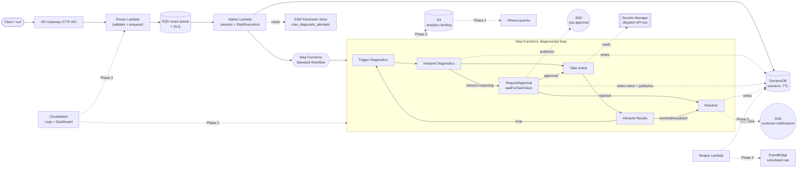

# SmartHelp Telco Support Automation Engine (Portfolio POC)

A scaled-down, faithful replica of a serverless telco-support automation
engine: a customer reports a broadband issue, the system runs a
diagnose → interpret → act → interpret loop, pauses for **human approval**
before any network-impacting action, then notifies the customer and records
the resolution. This repo is both a deployable AWS project and my interview
study guide for it — architecture rationale and Q&A live in this README as
the project grows.

**Status: Phase 2 of 5 — deployed and verified in `dev`.** The full
diagnose → interpret → act → interpret loop runs end-to-end on real AWS: a
case submitted through API Gateway is picked up off SQS, run through a
Step Functions Standard workflow, paused at a `waitForTaskToken` gate for
network-impacting actions, resumed via the AWS CLI, and resolved with the
final state written to DynamoDB and a customer notification published to
SNS. Both the human-approval path and the fully-automatic (no approval
needed) path have been exercised against the live deployment. Phase 3+ are
designed but not yet built; phases are tracked at the bottom of this file.

## Architecture (target — grayed-out pieces arrive in later phases)



### Request flow (current, Phase 2)

1. Client sends `POST /cases` to the API Gateway HTTP API `$default` stage.
2. The **router Lambda** validates the body and does exactly one thing:
   `sqs:SendMessage` onto the cases queue, returning `202 Accepted` with a
   generated `case_id` immediately. It never touches DynamoDB or Step
   Functions — that split keeps the client-facing response fast regardless
   of how long session setup takes downstream.
3. The **starter Lambda** (SQS event source mapping, `batch_size=1`) turns
   that message into a running workflow: it calls
   `states:StartExecution` (execution name = `case_id`, so retries are
   idempotent) and then writes the initial DynamoDB session record
   (`ConditionExpression="attribute_not_exists(case_id)"`, so a duplicate
   SQS delivery is a no-op). It also reads `max_diagnostic_attempts` from
   SSM Parameter Store, cached at cold start.
4. The Step Functions **Standard** workflow runs the loop:
   - `TriggerDiagnostics` → `InterpretDiagnostics` (a rules engine that also
     writes the interim decision to DynamoDB).
   - If the recommended action is network-impacting (`REBOOT`/`DISPATCH`),
     the workflow enters `RequestApproval` — a `lambda:invoke.waitForTaskToken`
     Task that persists the pause token to DynamoDB and publishes an SNS
     notification, then genuinely pauses (bounded by a 24h `TimeoutSeconds`)
     until something outside the state machine calls
     `SendTaskSuccess`/`SendTaskFailure`.
   - Once approved (or if no approval was needed), `TakeAction` executes the
     action (DISPATCH reads a mock API key from Secrets Manager),
     `InterpretResults` decides resolved / loop-back / escalate, bounded by
     `max_attempts` so the loop can't spin forever.
   - `Resolver` (also the target of every `Catch`) writes the final
     DynamoDB status and publishes a customer notification to SNS.
5. Approving a paused case in this POC is a manual AWS CLI step (see
   "Demo: approving a pending case" below) rather than a dedicated approval
   API/UI — deliberately, to keep the interesting content here about the
   Step Functions human-in-the-loop mechanics, not a second CRUD endpoint.

## Why these choices (interview notes — grows every phase)

**Why API Gateway *HTTP API* and not a REST API?**
HTTP APIs are ~70% cheaper per request and have lower latency than REST APIs
for straightforward proxy-Lambda use cases. REST API's extra features
(request validation models, usage plans, API keys, WAF integration) aren't
needed here — the router Lambda does its own validation. I'd reach for REST
API if this needed per-key usage plans/quotas or edge-optimized custom domains
with WAF.

**Why one router Lambda with internal routing instead of one Lambda per
route?**
Mirrors the real system's access/router layer: a single entry point owns
auth/validation concerns uniformly, and `APIGatewayHttpResolver` gives
Flask-like `@app.get`/`@app.post` decorators so it doesn't turn into a big
if/elif block. It also means one cold start path and one IAM role to reason
about for the entry point, with business logic split into separate Lambdas
further into the workflow (Phase 2).

**Why build the Powertools Lambda layer ourselves instead of using AWS's
public layer ARN?**
AWS publishes a managed Powertools layer, but its ARN is
region/version/architecture-specific and lives outside this repo — anyone
cloning it would need to look up the right ARN. Building it via
`pip install --target` + `archive_file` keeps the dependency pinned and
reproducible from `requirements.txt`, at the cost of a slightly more complex
module (see `infra/modules/lambda_layer`). Trade-off I'd mention: the
self-built layer costs a `pip install` on every `requirements.txt` change;
the public layer costs nothing to adopt but couples you to AWS's release
cadence and ARN naming.

**How is IAM least-privilege applied?**
Every Lambda gets its own execution role (not a shared one). The `lambda`
module scopes the logging policy to that function's exact log group ARN
(`${log_group_arn}:*`), not `arn:aws:logs:*:*:*`. Each function attaches
only the `additional_policy_json` it actually needs — e.g. `diagnose` and
`interpret_results` are pure compute with no extra policy at all,
`interpret_diagnostics` gets `dynamodb:UpdateItem` and nothing else,
`act` gets exactly `secretsmanager:GetSecretValue` on the one dispatch
secret — rather than one broad policy shared across all functions.

**Why S3 + DynamoDB for remote state, and why split by `-backend-config`
instead of Terraform workspaces?**
S3 gives durable, versioned state; the DynamoDB table provides state locking
so two `apply`s can't race. I used per-env `backend.hcl` + `-var-file`
instead of workspaces because workspaces share the same backend config and
make it easy to accidentally apply the wrong `.tfvars` against the wrong
state — separate backend keys per env (`dev/terraform.tfstate`,
`qa/...`, `prod/...`) make the blast radius of a mistake smaller and the
`terraform init` command itself makes the target environment explicit.

*Note:* recent AWS provider versions support native S3 locking
(`use_lockfile = true`, conditional writes, no DynamoDB table needed) and
deprecate the `dynamodb_table` backend parameter this repo uses. I kept the
DynamoDB-lock pattern deliberately — it's still fully supported, and it's
the pattern most interviewers will recognize; worth mentioning the newer
alternative exists if asked.

**Tagging strategy:** every resource gets `Project=telco-support-poc` and
`Environment=<env>` via the AWS provider's `default_tags`, so Cost Explorer
can filter by tag without me having to remember to tag each resource
individually.

**Why split "starter" out of the router Lambda instead of having the
router call StartExecution directly?** Two different jobs with two
different latency/reliability profiles: the router's job is "acknowledge
the client fast," the starter's job is "reliably stand up durable state
for a case," which involves two API calls (DynamoDB + Step Functions) that
can be retried independently by SQS if the Lambda fails partway. Coupling
them would make the client's HTTP response wait on both.

**Why does `starter.py` call `StartExecution` *before* the DynamoDB
write, not after?** Both operations are individually idempotent
(`StartExecution` by execution name, the DynamoDB write by a
`ConditionExpression`), but SQS's at-least-once delivery means the Lambda
can die between the two calls and get redelivered. Whichever operation
runs second is the one that's "unsafe" to lose — doing `StartExecution`
first means a redelivery after a partial failure always still reaches the
DynamoDB write; if it were the other way round, a case could get a
session record but never actually start a workflow, silently stuck.

**Why `lambda:invoke.waitForTaskToken` for the approval gate instead of
`sns:publish.waitForTaskToken` directly?** SNS's native waitForTaskToken
integration would skip a Lambda, but the token still needs to land
*somewhere durable* (DynamoDB) so it can be looked up later by `case_id` —
that requires code to run regardless. Routing through a Lambda keeps every
Task in this workflow structurally identical (a Lambda invoke), which
made the whole state machine easier to build, test, and reason about than
mixing direct-service integrations with Lambda tasks for one special case.

**Why no approval API/UI?** The interesting, teachable mechanic here is
Step Functions pausing on a task token and resuming via
`SendTaskSuccess` — an API Gateway route + Lambda that just deserializes a
JSON body and calls the same SDK method wouldn't add anything to that
story, so approving via the AWS CLI (see the demo below) demonstrates the
identical human-in-the-loop pattern with less to build and explain.

**Why bound the loop with `max_attempts` in `interpret_results` instead of
relying only on Step Functions?** Step Functions doesn't have a built-in
"loop N times" primitive — a Choice state routing back to an earlier
state will run forever unless something in the data decides to stop. The
attempt counter (sourced from SSM config, not hardcoded) is that
something; `HandleFailure`'s Catch-based safety net protects against
*unexpected* errors, but the loop's *normal* termination is the
Lambda-level attempt bound.

**Why Secrets Manager for the dispatch API key but SSM for
`max_diagnostic_attempts`?** Secrets Manager adds automatic rotation
support and tighter access auditing, at ~$0.40/mo per secret — worth it
for something that's actually credential-shaped (an API key). A retry
count isn't a secret; SSM Parameter Store's String type is free and
sufficient. Using both in one project (rather than putting everything in
one or the other) is itself the point: pick the store based on what the
value *is*, not habit.

**Where does this design NOT enforce strict least-privilege?** The Step
Functions execution role's CloudWatch Logs permissions
(`logs:CreateLogDelivery` etc., see `infra/modules/step_functions/main.tf`)
are scoped to `resources = ["*"]` — this is a documented AWS requirement
for the log-delivery subscription mechanism Step Functions logging uses,
not a shortcut I chose. Worth naming directly if asked "is everything here
least-privilege" — the honest answer is "everywhere except one
AWS-mandated exception."

## Repo layout

```
infra/
  versions.tf, providers.tf, variables.tf, main.tf, outputs.tf   # root module
  envs/{dev,qa,prod}/{backend.hcl, <env>.tfvars}                 # per-env config
  state_machine/telco_workflow.asl.json.tftpl                    # ASL, templated with each Lambda's ARN
  modules/
    lambda/           # generic Lambda function + its own log group + IAM role
    lambda_layer/      # pip-installs a requirements.txt into a Lambda layer
    http_api/          # API Gateway HTTP API, $default route/stage, access logs
    step_functions/    # state machine + its IAM role (scoped to just the Lambdas it invokes)
src/
  router/handler.py               # validate + enqueue
  starter/starter.py               # SQS -> DynamoDB session + StartExecution
  diagnose/diagnose.py             # mock diagnostics
  interpret_diagnostics/           # rules engine -> recommended_action
  request_approval/                # waitForTaskToken gate: persist token, notify
  act/act.py                        # performs the action (reads Secrets Manager for DISPATCH)
  interpret_results/                # resolved / loop / escalate decision
  resolver/resolver.py              # final DynamoDB write + customer SNS notification
  layers/powertools/requirements.txt
tests/                # pytest, one test module per Lambda (25 tests)
.github/workflows/     # CI/CD (Phase 4)
```

## One-time setup: bootstrap the Terraform state backend

The S3 bucket and DynamoDB lock table have to exist *before* `terraform init`
can use them as a backend — Terraform can't create the backend it's about to
store state in. Run once, with the AWS CLI, picking a globally-unique bucket
suffix (e.g. your account ID):

```bash
export STATE_SUFFIX=<your-unique-suffix>   # e.g. your 12-digit AWS account ID
export AWS_REGION=us-east-1

aws s3api create-bucket \
  --bucket telco-support-poc-tfstate-$STATE_SUFFIX \
  --region $AWS_REGION

aws s3api put-bucket-versioning \
  --bucket telco-support-poc-tfstate-$STATE_SUFFIX \
  --versioning-configuration Status=Enabled

aws s3api put-bucket-encryption \
  --bucket telco-support-poc-tfstate-$STATE_SUFFIX \
  --server-side-encryption-configuration '{"Rules":[{"ApplyServerSideEncryptionByDefault":{"SSEAlgorithm":"AES256"}}]}'

aws dynamodb create-table \
  --table-name telco-support-poc-tf-locks \
  --attribute-definitions AttributeName=LockID,AttributeType=S \
  --key-schema AttributeName=LockID,KeyType=HASH \
  --billing-mode PAY_PER_REQUEST
```

Then replace `<YOUR_UNIQUE_SUFFIX>` in `infra/envs/dev/backend.hcl` (and
qa/prod, once you use them) with the same suffix.

## Deploy (dev)

```bash
cd infra
terraform init -backend-config=envs/dev/backend.hcl
terraform plan  -var-file=envs/dev/dev.tfvars
terraform apply -var-file=envs/dev/dev.tfvars
```

The first `apply` pip-installs the Powertools layer locally (needs `pip3` on
your machine/CI runner) — expect that resource to show as
"(known after apply)" on the *first* `plan`, since the layer's zip contents
depend on a `terraform_data` provisioner that only runs at apply time.

**Optional: real email notifications.** Set `approver_email` and/or
`customer_notification_email` in `envs/dev/dev.tfvars` before applying to
subscribe a real address to the ops-approval / customer-notification SNS
topics — AWS emails a confirmation link you have to click before messages
start arriving. Left blank (the default), you verify everything via the
AWS CLI/console instead, as the demo below does.

## Demo

### Health check and validation

```bash
API=$(terraform -chdir=infra output -raw api_endpoint)

curl "$API/health"
# {"status":"ok","service":"telco-support-router"}

curl -X POST "$API/cases" -H 'content-type: application/json' -d '{}'
# 400 — {"statusCode":400,"message":"missing required field(s): customer_id, issue_type"}
```

### Case that needs human approval (`modem_offline` → REBOOT)

```bash
curl -X POST "$API/cases" -H 'content-type: application/json' \
  -d '{"customer_id": "cust-123", "issue_type": "modem_offline"}'
# {"message": "case accepted", "case_id": "case-c90855ddb3e7"}

# A few seconds later, the workflow has paused waiting for approval:
aws dynamodb get-item \
  --table-name "$(terraform -chdir=infra output -raw sessions_table_name)" \
  --key '{"case_id":{"S":"case-c90855ddb3e7"}}'
# status = "PENDING_APPROVAL", task_token = "AQCE..." (a real Step Functions task token)
```

### Approving a pending case

No approval API exists in this POC on purpose (see rationale above) — fetch
the token from DynamoDB and resume the paused execution directly:

```bash
TASK_TOKEN=$(aws dynamodb get-item \
  --table-name "$(terraform -chdir=infra output -raw sessions_table_name)" \
  --key '{"case_id":{"S":"case-c90855ddb3e7"}}' \
  --query 'Item.task_token.S' --output text)

aws stepfunctions send-task-success --task-token "$TASK_TOKEN" --task-output '{"approved": true}'
# (use --task-output '{"approved": false}' instead to see the REJECTED resolution path)

# Watch it resolve:
aws stepfunctions describe-execution \
  --execution-arn "$(terraform -chdir=infra output -raw state_machine_arn):case-c90855ddb3e7" \
  --query '{status:status,output:output}'
# {"status": "SUCCEEDED", "output": "{\"case_id\": \"case-c90855ddb3e7\", \"resolution_type\": \"RESOLVED\"}"}
```

### Case that never needs approval (`intermittent_drops` → auto-resolves)

```bash
curl -X POST "$API/cases" -H 'content-type: application/json' \
  -d '{"customer_id": "cust-456", "issue_type": "intermittent_drops"}'
# {"message": "case accepted", "case_id": "case-ff31883ad9ea"}

# Resolves end-to-end in ~1 second with zero human involvement — the
# execution never enters RequestApproval because InterpretDiagnostics
# decided the issue wasn't network-impacting.
```

All three of the above were run against the real `dev` deployment while
building this phase — not just asserted by unit tests.

## Cost & Teardown

Everything provisioned through Phase 2 (API Gateway, 8 Lambdas + a shared
layer, DynamoDB PAY_PER_REQUEST, SQS + DLQ, SNS, Step Functions Standard,
SSM String parameters, CloudWatch log groups) fits AWS Free Tier /
pay-per-request pricing for demo-level traffic — nothing runs 24/7 or bills
per-hour, **except one thing**:

- **Secrets Manager** (`telco-support-dev-dispatch-api-key`) bills
  ~$0.40/month flat while it exists, regardless of how often it's read.
  This is the one deliberate exception called out in the project spec —
  everything else config-shaped uses free SSM Parameter Store instead.

Step Functions Standard workflows bill per state transition
($0.025 per 1,000) — a single case through this workflow is ~6-9
transitions, effectively free at demo volume.

To tear down:

```bash
cd infra
terraform destroy -var-file=envs/dev/dev.tfvars
```

The S3 state bucket and DynamoDB lock table from the bootstrap step are
**not** managed by this Terraform config (chicken-and-egg), so destroy them
manually if you want a full teardown:

```bash
aws s3 rb s3://telco-support-poc-tfstate-$STATE_SUFFIX --force
aws dynamodb delete-table --table-name telco-support-poc-tf-locks
```

## Deployment history — how this has actually been shipped so far

Being explicit about this because it's a common interview follow-up
("where's this hosted, how'd you deploy it") and because it's a deliberate,
staged choice, not an oversight:

- **Source control:** local git repo only so far (`git init` in this
  directory, 2 commits). **No GitHub remote configured yet** — nothing has
  been pushed anywhere.
- **Deploy mechanism for Phase 1: manual, from a local machine.** No
  pipeline exists yet. The sequence that actually happened:
  1. Installed the AWS CLI and Terraform locally (`brew install awscli`,
     `brew install hashicorp/tap/terraform`).
  2. Configured credentials with `aws configure` (an IAM user with
     `AdministratorAccess`, scoped to a personal sandbox account — verified
     with `aws sts get-caller-identity`).
  3. Ran the one-time bootstrap (S3 state bucket + DynamoDB lock table)
     via raw `aws` CLI commands, since Terraform can't create the backend
     it's about to store its own state in.
  4. `terraform init -backend-config=envs/dev/backend.hcl`, then
     `terraform plan` / `terraform apply -var-file=envs/dev/dev.tfvars` —
     applied directly against AWS account `705365103500`, region
     `us-east-1`.
  5. Verified the result wasn't just "terraform says success" — hit the
     live API Gateway URL with `curl` for `/health` and `/cases` (valid and
     invalid payloads), then tailed the actual CloudWatch log group
     (`aws logs tail /aws/lambda/telco-support-dev-router`) to confirm the
     Powertools structured logs (`cold_start`, `xray_trace_id`,
     `function_request_id`) were landing correctly.
- **This is intentional, not a gap:** doing Phases 1–3 with manual
  `terraform apply` means every new AWS concept (state locking, IAM roles,
  Step Functions, human-approval tokens, etc.) gets seen directly, one
  `apply` at a time, instead of being hidden behind a pipeline before it's
  understood. **Phase 4 is exactly this gap being closed on purpose:**
  push to a GitHub remote, then add GitHub Actions to do lint → pytest →
  `terraform plan` on PR → `terraform apply` on merge to `main` — the same
  stages the real production system ran through Jenkins + SonarQube.
- **Phase 2 was deployed the same way** — `terraform plan`/`apply` from a
  local machine against the same `dev` state — plus a manual end-to-end
  verification pass that specifically exercised the two things a passing
  `terraform apply` can't prove on its own: that the workflow actually
  *pauses* at the approval gate (checked via `aws dynamodb get-item`
  showing `PENDING_APPROVAL` + a real task token), and that it *resumes*
  correctly after `aws stepfunctions send-task-success` (checked via
  `describe-execution` showing `SUCCEEDED`). Also confirmed the SQS queue
  drained to 0 and nothing landed in the DLQ — a clean run, not just "no
  error was thrown."

## Interview Q&A (running list — grows every phase)

- **"Walk me through what happens when a request comes in."** → see Request
  flow above.
- **"Why not put all the routing logic in API Gateway?"** → API Gateway route
  keys would work for this simple case, but the real system's access layer
  needs to run auth/validation code, which belongs in Lambda, not gateway
  config — so it's one proxy route in and structured routing inside the
  function.
- **"How do you avoid a surprise AWS bill on a personal account?"** →
  Free-tier-only live services, `enable_tier2`/`enable_tier3` default false
  in Terraform so nothing that costs real money deploys by accident, no NAT
  Gateway anywhere, `terraform destroy` documented, resources tagged for
  Cost Explorer.
- **"Is this running through a CI/CD pipeline?"** → Not yet, by design —
  see "Deployment history" above. Phases 1–3 are deployed manually so each
  new AWS service is understood in isolation before automation hides the
  mechanics; Phase 4 adds GitHub Actions (lint/test/plan on PR, apply on
  merge), mirroring the real system's Jenkins + SonarQube stages.
- **"Walk me through the human-approval mechanism, concretely."** →
  Step Functions' `lambda:invoke.waitForTaskToken` integration hands a
  unique token to the `request_approval` Lambda instead of waiting for its
  return value; that Lambda persists the token to DynamoDB and publishes
  an SNS notification, then the *execution itself* is suspended — no
  compute is running or billing while paused. Anything holding the token
  (a human via the CLI, in a real system an approval API/UI) calls
  `SendTaskSuccess`/`SendTaskFailure` to resume it, bounded by a
  `TimeoutSeconds` so a case can't stay paused forever.
- **"How do you keep the diagnose/act loop from running forever?"** →
  Step Functions has no native loop counter — `interpret_results` tracks
  `attempt` vs. a `max_attempts` config value (sourced from SSM, read once
  per cold start) and only routes back to `TriggerDiagnostics` while
  attempts remain; once exhausted, it force-resolves to `ESCALATED`
  instead of looping again.
- **"What happens if a Lambda in the workflow throws?"** → Each Task has a
  `Retry` (transient Lambda service errors, exponential backoff, 3
  attempts) and a `Catch` (`States.ALL` → `HandleFailure`, which reuses the
  `resolver` Lambda to write a `FAILED` status and notify, then the
  execution ends in a Step Functions `Fail` state — so it shows up
  correctly in execution-history metrics as a failure, not a quiet
  success).
- **"Why does one Lambda (`resolver`) get invoked from three different
  places in the state machine?"** → Every path — normal resolution, an
  approver rejecting the action, and any Catch-routed failure — needs the
  same two side effects (final DynamoDB write, customer SNS notification).
  `resolver` derives which of the three happened from the *shape* of its
  input (`error` present → FAILED; `approval.approved is False` → REJECTED;
  otherwise reads `outcome.resolution_type`) rather than needing three
  near-duplicate Lambdas.

## Learning notes (Phase 1) — concepts to know cold for interviews

Things worth being able to explain confidently, not just having typed:

1. **Terraform's plan/apply model.** State (now in the S3 bucket) is
   Terraform's record of what it believes exists; `plan` diffs that record
   against your `.tf` files before anything touches AWS. Running `plan`
   again with no code changes should show "0 to add, 0 to change,
   0 to destroy" — that's the mental model for everything built from here on.
2. **IAM: trust policy vs. permission policy.** See
   `infra/modules/lambda/main.tf` — `assume_role_policy` (trust policy)
   says *who* can assume the role (the Lambda service principal);
   `aws_iam_role_policy` (permission policy) says *what* it can do once
   assumed. Conflating these two is one of the most common IAM mistakes.
3. **Lambda execution model.** Cold start vs. warm (visible in the
   CloudWatch logs as `"cold_start":true`/`false`), the `(event, context)`
   handler signature, and that a layer is just a zip mounted onto
   `PYTHONPATH` — nothing more exotic than that.
4. **API Gateway `AWS_PROXY` integration.** The raw event is handed to
   Lambda untouched, and Lambda's response must match the expected shape
   (`statusCode`/`body`/`headers`) or API Gateway returns a 500 — that
   contract is the whole reason `APIGatewayHttpResolver` exists.
5. **CloudWatch log retention.** Lambda log groups default to *infinite*
   retention if you don't set one — `log_retention_days` in the `lambda`
   module exists specifically to avoid that silent cost creep at scale.

**Exercises that build intuition on what's already deployed:**
- Change the `/health` response text, run `terraform plan` — notice only
  the Lambda's `source_code_hash` changes, nothing else is touched.
- Deliberately break the handler path and `apply` — compare what an
  "infra is wrong" Terraform error looks like vs. what a broken-handler
  Lambda invocation looks like in CloudWatch. Telling those apart quickly
  is a real on-call skill.
- Run `aws lambda get-function --function-name telco-support-dev-router`
  and read the raw JSON — ties the console/Terraform view back to the
  underlying API.

## Learning notes (Phase 2) — concepts to know cold for interviews

1. **Step Functions ASL structure.** `Task`/`Choice`/`Retry`/`Catch` are
   the whole vocabulary this workflow needs — open
   `infra/state_machine/telco_workflow.asl.json.tftpl` and trace one path
   (e.g. the REBOOT-needs-approval path) top to bottom before an interview;
   being able to read raw ASL, not just describe it abstractly, is the
   actual skill being tested.
2. **`ResultPath` vs. replacing `$`.** Every Lambda in the main chain
   returns the *entire* accumulated state (merge-then-return in Python),
   so Task states don't need `ResultPath` — except `RequestApproval`,
   which uses `"ResultPath": "$.approval"` specifically so whoever calls
   `SendTaskSuccess` only needs to supply `{"approved": true}`, not
   reconstruct the whole case. Knowing *why* that one state is different
   is more valuable than memorizing ResultPath syntax.
3. **SQS visibility timeout vs. Lambda timeout.** The cases queue's
   `visibility_timeout_seconds` (30) is set ≥ the starter Lambda's timeout
   specifically so a slow-but-still-running invocation can't get its
   message redelivered to a second concurrent invocation — a classic
   source of duplicate-processing bugs if the two aren't kept in sync.
4. **DynamoDB TTL isn't instant.** The `ttl` attribute schedules
   background deletion within (typically) 48 hours of the epoch timestamp
   — it's a cost/hygiene mechanism, not a real-time expiry guarantee. Don't
   rely on it for anything time-sensitive.
5. **Idempotency ordering under at-least-once delivery.** See the
   "Why does `starter.py` call StartExecution before the DynamoDB write"
   rationale above — this is the single most interview-relevant piece of
   Phase 2 code, because it's a general pattern (order side effects so a
   crash between them is always safely retryable), not something specific
   to Step Functions or DynamoDB.

**Exercises that build intuition on what's already deployed:**
- Open the Step Functions console for `telco-support-dev-workflow` and
  look at the graph view for the two executions run in the demo above —
  visually compare the paused-then-resumed execution against the
  straight-through one.
- Submit a case with an `issue_type` not in `diagnose.py`'s severity map
  (falls back to `_DEFAULT_SEVERITY`) and see how it's handled — confirms
  you understand the mock data's fallback behavior, not just its happy path.
- Call `send-task-success` with `{"approved": false}` on a pending case
  and confirm it resolves as `REJECTED` rather than proceeding to
  `TakeAction` — exercises the one branch the "Demo" section doesn't walk
  through by default.

## Phases

- [x] **Phase 1** — Terraform skeleton, backend, one Lambda, API Gateway (live)
- [x] **Phase 2** — Step Functions workflow, DynamoDB, SQS, SNS, SSM, Secrets
      Manager, diagnose/act Lambdas, human-approval gate (live, end-to-end
      verified: pause/approve/resolve and full auto-resolve paths)
- [ ] **Phase 3** — EventBridge reaper, CloudWatch dashboard, S3/Athena analytics
- [ ] **Phase 4** — GitHub Actions CI/CD
- [ ] **Phase 5 (optional, disabled by default)** — RDS/VPC, Glue/EMR, OpenSearch
